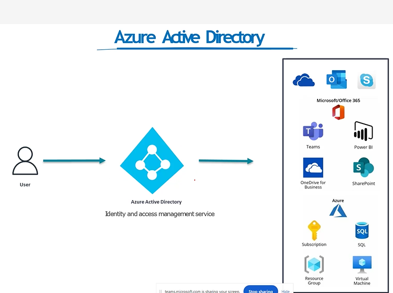
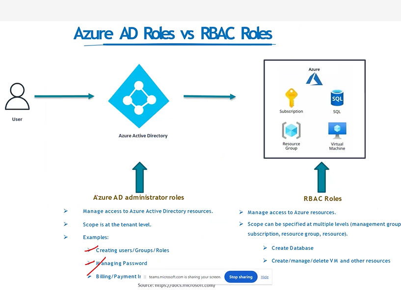
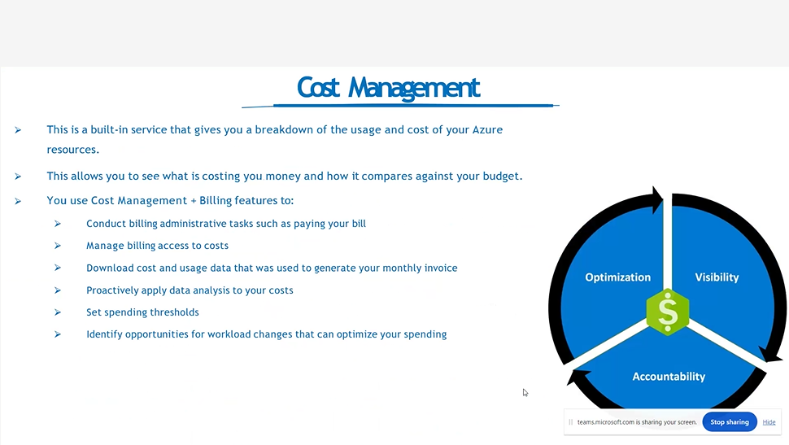
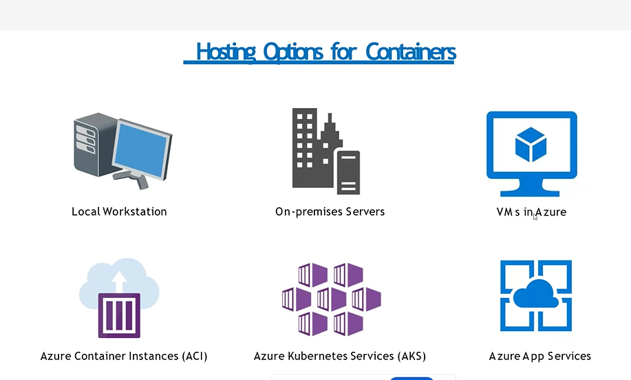
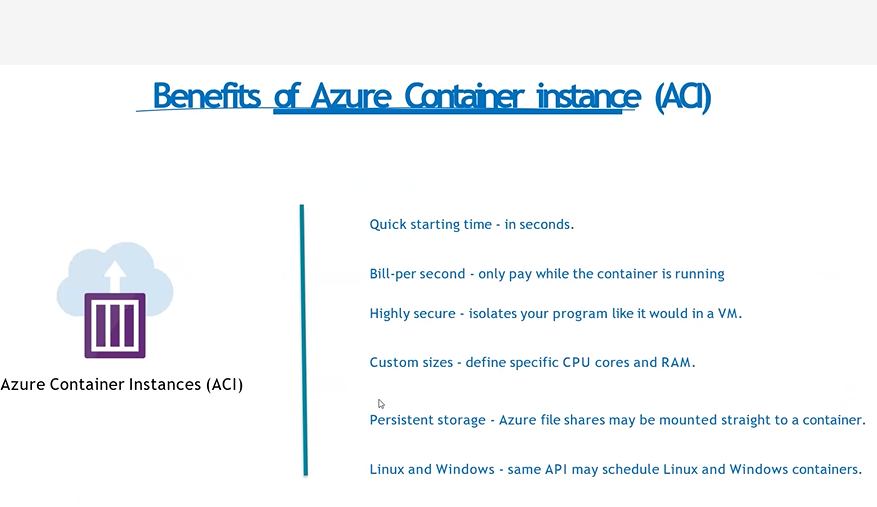
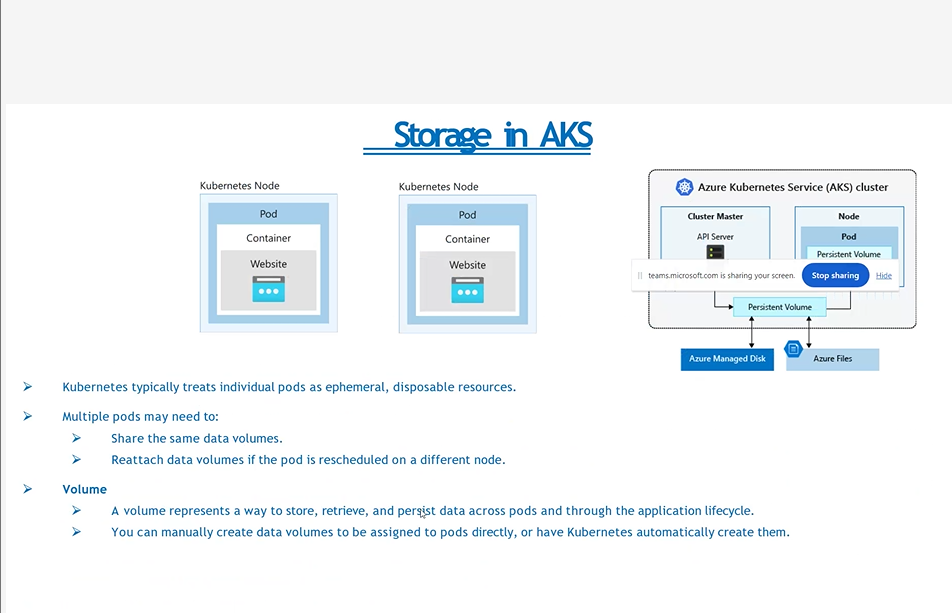
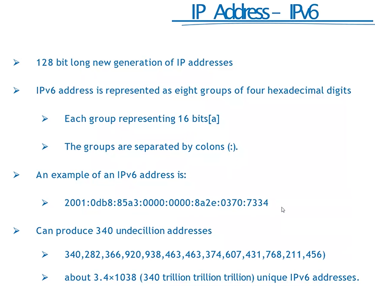
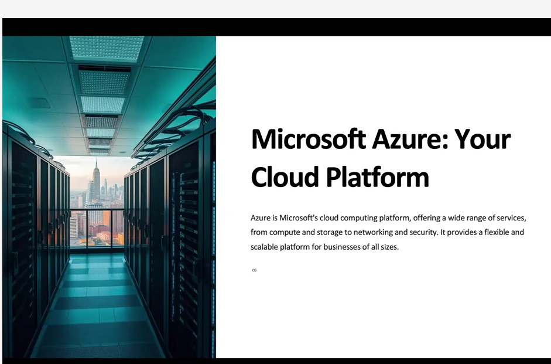
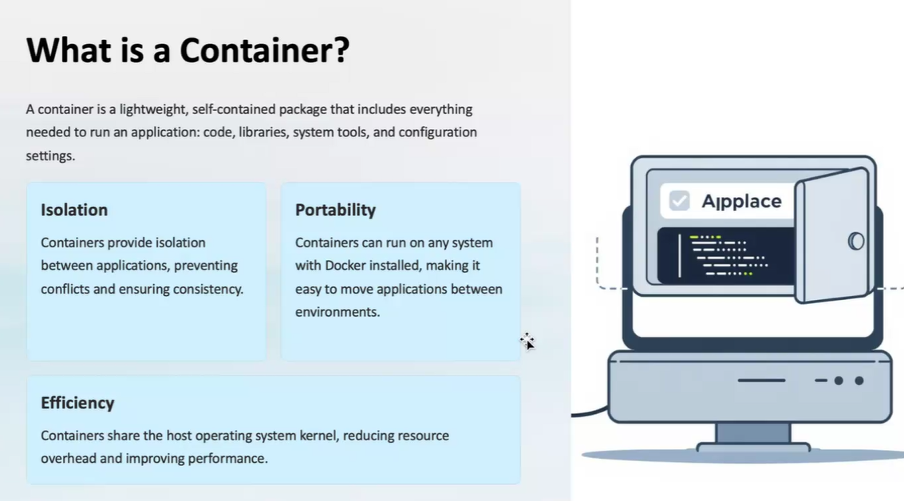

## Thursday(22/08/2024)

## Introduction to Cloud Computing :

- 
- 
- Pay per use
- no maintenance and it will maintained by the cloud providers
- Autoscalling : increase/decrease the setup automattically based on requirement

## what is Cloud Computing :

- 
- internet based computing
- ondemand resources delivered to your over the internet
- same resources shared by multiple clients
- Ex : Gmail , Netflix
- Set Budget :
- 
- We can also go for " Pay as u go model "

## Benefits of Cloud Computing:

- 
- 
- 

## Types of Cloud Services :

- 
- Saas : we are using the buit in apps ,
- Pass :we are developing the application
- Iass : we have to take care of all the infras like installatonns , maintenance, code,

## IaaS vs PaaS vs SaaS :

- 
- 
- on premises : we have to take care of all the things
- Iaas : blank laptop , we have to install and code our own application, they will provide server , storage like PC
- Pass : ex : we need a python setup they will provide all , only thing is we have to develop or code our own applciation
- Saas : Every thing is readymade , we have to use only
- 

## Types of Cloud Computing :

- 
- 
- Public Cloud : accessible to everyone , managed by 3rd party cloud providers , less control to users ,
- Private Cloud : not accessbile to general public , utilized by particular organization , strict security , control to users only.
- Hybrid Cloud : combination of public and private , expensive , complicate to maintain.
- 
- 
- 
- 
- 
- 
- 
- 

## Azure Regions :

- 

## Azure Region Pairs :

- 

## Availability Zones :

- 
- Inside Availability Zone there are set of data centres
- set of data centres
- one data centres goes down , another data centre available all the time
- We will have a copy of data centres , azure will take care of all
- Availability Zones having independent powers
- Availability Zones should within the 100km to each one
  

## Resources :

- Instances created by us

## Resource Groups :

- 
- resources are combine into resource groups
- 1 Resource having only 1 resource group
- we can switch from 1 resources to one resource group

## Subscriptions :

- User accounts , resources created by users , we will get subscription id we have to pay
- 

## Management Groups :

- Organize Multiple Subscriptions as a single management entity
- Helps us to manage for multiple Subscriptions.Big companies uses it
- 
- Each Management Groups[Parent] have many childs

## Azure Resource Manager[ARM] :

- 
- We have template to create resources by automatically
- ARM template = JSON File[defines what do we want to deploy to Azure]
- Integrate with Azure, PowerShell, CLI , REST API Etc

## Azure Active Directory

- cloud based access management service
- 
- 
- Tenant : means Organization
- 
- 
- 
- 
- 
- 
- 
- 
- 
- 
- 

## Azure Roll Based Access Control [ARBAC]

- 
- 
- 
- 
- 
- 

## Cost Management

- 

## Azure Storage Service

- 

## Azure Data Redundency :

- 
- 

## Blob Storage :

- 
- 

## Storage Access Tiers :

- 
- Hot : we have to to use/access this by daily/Frequently
- Cool :once in a month , week
- Archive :Once in a year , rarely
- 
- 

## Azure Table Storage : Nosql Storage

- 
- 

## Azure File Storage : virtual , stored in storage account

- Cannot be shared acrooss data centres , only for particular data centres
- 
- 

## azure Disk Storage :virtual , stored in storage account

- 

## Data Storage Authorization

- 

## Shared Access Keys Authorization

- 
- 
- 
- 
- 
- 
- 
- 
- 
- 
- 
- 
- 
- 
- 
- 
- 
- 
- 
- 
- 
- 
- 
- 
- 
- 
- 
- 
- 
- 

## ARM

- 
- 
- 
- 

## Friday(23/08/2024)

## Azure App Service

- Enables you to build and host webapps, background jobs, mobile back ends and RESTFul API's
- 
- AutoScalling
- High Avaialability : Never down
- Supports Windows and Linux only

## Types of App Service

- 
- Web Apps :
- API Apps
- Web Jobs
- MObile Apps

## Azure App Service BackUp

- 
- 

## Deployment Settings

- 
- 

## App Service- Security

- 

## Containers

- Wrap up an application into its own isolated package
- 

## ACI[container Instance] vs AKI[Kubernet Instance]

- 
- 
- 

## Virtual Machine vs COntainer

- 
- spin up : refresh the system

## Docker & Azure Container Registry

- 

## Docker

- 
- 
- 
- 
- 
- 
- 

## Kubernetes

- 
- 
- 
- 
- 

## Kubernetes architecure

- 
- 
- 

## Azure Kubernetes Services

- 
- 
- 
- 
- Deployment : one or more identical pods
- 
- 
- 

## Azure Networking Services

- 
- 
- 
- 
- 

## Public Vs Private IP Address

- 
- 

## Virtual net[Vnet]

- 
- 
- 
- 
- 
- ## Subnet masking
- 
- 
- 

## NIC Network Interface card : generated automatically whenever a vn is created

- 

## User Defined Route [UDR]

- 
- 

## Network peering

- 
- 

## Virtual Private Network[VPN]

- 
- 
- 

## Service Chaining

- 
- 
- 

## Domain Name System

- 
- 

## Azure DNS

- 
- 
- 
- 
- 
- 
- 
- 
- 
- 
- 
- 
- 
- 
- 
- 
- 

## Azure Load Balancer

- 
- 
- 
- 
- 
- 

## Load Balancer

- 

## Application GateWay

- 

## URL path based routing

- 

## Multi site Routing

- 
  ##V web application FireWall[WAF]
- 

## Application Gateway Components

- 

## Virutual WAN

## Express Route

- 
- 
- 
- 
- 
- 
- 
- 
- 

## Azure Monitor

- 
- 
- 

## Powershell cli commands

- 

## Wednesday(28/08/2024)

## Azure Training

## Cloud Computing : take features from onpremises[server] to cloud[serverless]

- physically we can see a server
- 
- Pay as you go[Costing]
- server less computing[cloud]
- infinite storage

## Shared Responsibilty Module :

- avaialability zone , resource group , services of azure etc.
- Avaialabilty zone : avaialability high , region can contains multiple avaialability zones/one AZ
- Resource Group :

## SAAS

- 
- 
- Scalability : Use as you go
- Accessibility : How much we access
- Auto Scaling group : automatically increse/decrease based on requirement
- Cost-effectiveness :
- Active Directory :user credentiALS ARE STORED her

## IAAS

- 

## PAAS

- 
- Develpement -->Testing[SIT, UAT,Integration Testing] --->Production[pre, production]
- Hybrid Cloud
- Both features of IAAS and SAAS
  
- 
- Abstraction : data Hiding
- 
- Paramters : for compute
- No of users
- turn around time
- Space /storage
- 

## Azure

- 
- cloud platform

## Azure Services

- 
- 1. Computation :trying to execute on server less machine
- 2. Storage : files , queues , tables and disks
- Container : place to store
- Virtual machine : is on cloud , to host application , server less machine
- 
- 3. Networking
- 4. Security
- 1. Azure Computation
- 
- virtual machine
- container
- Severless computing
- 2. Azure Storage
- 
- 3. Networking
- 

## Thursday(29/08/2024)

- 4. Azure Security : stores passwords , important data
- 
- Identity management : gives access to users , and provides services after verifying user credentials , having 2 methods
- Azure Active Directory for authentication[ checking user credentials] and authorization[giving access]
- Data Encryption
- Threat Protecion
- 5. Azure Monitoring : monitors the billing , costs of users , sends alerts to users through sms, mails regarding how much we have used on azure
- 

## Web Jobs: Background tasks that are run in azure

- 
- Background tasks that are run in azure
- Run by processor manager
- It automates the various tasks like processing , sending mails , monotoring our applications
- Azure monitoring beacause of webjibs

## Benefits of Webjobs

- 

## Types of Webjobs

- 
- 1. continuous wejobs : It runs continuously as long as they are active , ideal for longtime-running tasks like monitoring and data processing.
- 2. Triggered webjobs : Activated for specific tasks/events such as new files in a storage acount or messages in a queue
- 3. Scheduled webjobs : Executed according to a defined schedule , such a daily , weekly , or monthly for tasks requiring regular execution

## Deploying Webjobs

- 

## Monotoring and Debugging Webjobs

- 
- 

## Introduction to Container and Docker

### Container

- 
- lightweight , package it includes everything needed to run on an application

## Benefits of Containerization

- 
- Docker :
- 
- 

## Docker Architecuture

- 
- Docker Clients : commands
- Docker Daemon : Server/host machine
- Docker Image : Instructions to create a contaner
- Registry : stores images
- Design a docker image for any aplication deployment

## Azure Resource manager : Is in json format

## Docker Images

- 
- 
- 
- Cosmos DB : Azure self developed Data base

## Friday(30/08/2024)

## Rivison on Previous Topics :

- Resouce Group : A resource group is a container that holds related resources for an Azure solution. The resource group can include all the resources for the solution, or only those resources that you want to manage as a group.
- stores metadata about the resources.
- Virtual Machine : Service

### Devops : Done Manually

- Developement Operations
- It having branches
- Repository : place where all codes are available
- Source Code Management : tool to maintain codes
- main branch : Production Environment
- Ops : Production
- ITSM : Information technology service management
- 3 parts :Source code management, Staging , Deplyoment -->Deployment Life cycle /PipeLine
- Continuous Integration :
- Continuous Developement:

## ARM :

- Azure Resource Manager (ARM) is a Microsoft Azure service that helps users manage and deploy resources for their Azure account
- ARM uses resource providers to create, update, delete, or retrieve resources in an Azure environment.
- ARM template :
- A JavaScript Object Notation (JSON) file that defines one or more resources to deploy to a resource group, subscription etc...
- 1 Project have 1 ARM , ARM creates Automatically

## Container :

- contains zip , files , codes , all
- Container Engine :Docker
- CICD : automtatically dones the tasks like releases, tags , versions etc..
- Vm - can create os, files
- azure will deploy the container

## Resource vs Services :

- A service is a set of features in Azure
- A resource is the product or object of a service.
- 

## Choosing Azure Regions

- 
- Latency : when any user requesting a service , it will takes time to respond i.e "Latency"[Delay]
- Data Sovereignty : mainatenace of data
- Pricing : Cost
- Avaialability Zones : utilizing zones for resources by deploying our application across physically seperated data centre[Backup] within a region
- 
- Disaster Recover[DR]
- Azure Content Delivary Networ[CDN]
- Resource manAGER - RESOURCES\_\_>ALL

## Microservices :

- 
- Independent Deployment : releasing versions one after another
- Technology Diversity : Different services can use different technologies , allowing teams to choose the best tool for the job.
- Improved scalability : based on demand it allows scaling
- Resilience and Fault Tolerance : Failures in one service are less likely to impact other services , improving application resilience
- 
- Consistency : maintaining same data by not decreasing
- Increased Complexity :
- Distributed Complexity:

## Microservices Architecture

- 
- 

## Git

- Git is an open-source distributed version control in DevOps
- 

## Question 1 : C&D

The development teams that support the Agile approach to DevOps must include staff from the operations teams to ensure:

- A) That stability is prioritised over creativity
- B) Operational considerations are prioritised over stability
- C) Operational considerations are taken into account
- D) The resultant designs of the systems will fit nicely into the business as usual environment

## Question 2 : C

Which statement best describes the relationship between DevOps and Continuous Delivery?

- A) DevOps and Continuous Delivery are the same thing.
- B) DevOps and Continuous Delivery are not related and are mutually exclusive.
- C) DevOps and Continuous Delivery share a background in Agile methods and LEAN thinking.
- D) DevOps and Continuous Delivery share common processes.

## Monday (02/09/2024)

## Microservices Solid Principles :

- 
- Single Responsibility : Each module or a class should have a one and only one reason to change
- Open/Closed :Instead of modifying resources we can change services
- Liskov Substitution: pay as you go like procedure, This means that objects of the child class should be able to substitute objects of the parent class without causing any issues or breaking the application's integrity.
- Ex : 
- Interface Segregation :Azure uses logical isolation to segregate each customer’s data from the data of others. Segregation provides the scale and economic benefits of multi-tenant services while rigorously preventing customers from accessing one another’s data.
- Dependency Inversion/injection : Technique to achieve Inversion of Control (IoC) between classes and their dependencies. Dependency injection in Azure Functions is built on the.NET Core Dependency Injection features.
- Ex : 

## Monolithic Application vs MicroService :

- 

## Tuesday(03/09/2024)

- 
- 
- Branch Policy :who can access to which branch .

## Kubernetes :

- 
- 
- Pods : container
- Cluster : summation of Pods

## Architecture :

- 
- Master Node : It manages all the slave nodes
- Slave Node : Contains Pods[is equals to container]
- Cluster made up of : Master node + Many Slave nodes
- 
- Etcd : used to store the configuration ans state of the cluster
- Kubelet[Processor] :runs on each slave node and manage the pods running on that node
- 
- kube-apiserver: The core component server that exposes the Kubernetes HTTP API
- etcd : Consistent and highly-available key value store for all API server data
- kube-scheduler : Looks for Pods not yet bound to a node, and assigns each Pod to a suitable node.
- kube-controller-manager
  Runs controllers to implement Kubernetes API behavior.
- cloud-controller-manager (optional)
  Integrates with underlying cloud provider(s).
- Kubernetes Pods : 

## cloud Shell commands

- 1.To create Aplication NAme : az group create --name myapp-rg --location eastus
- 2. To create Resource group :
- az acr create --resource-group myapp-rg --name mycontainerregistry --sku Basic
- az aks create\
- 

## physical devices that connect to and exchange information with a computer network

- Kubernetes Deployment :
- 
- Kubernetes Services :
- 

## Network Policy

- 
