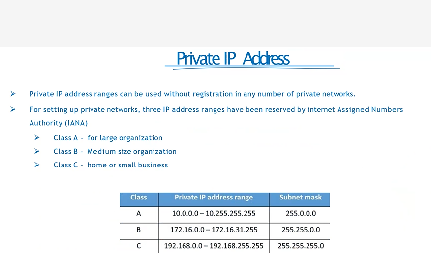

## Thursday(22/08/2024)

## Introduction to Cloud Computing :

- 
- 
- Pay per use
- no maintenance and it will maintained by the cloud providers
- Autoscalling : increase/decrease the setup automattically based on requirement

## what is Cloud Computing :

- 
- internet based computing
- ondemand resources delivered to your over the internet
- same resources shared by multiple clients
- Ex : Gmail , Netflix
- Set Budget :
- 
- We can also go for " Pay as u go model "

## Benefits of Cloud Computing:

- 
- 
- 

## Types of Cloud Services :

- 
- Saas : we are using the buit in apps ,
- Pass :we are developing the application
- Iass : we have to take care of all the infras like installatonns , maintenance, code,

## IaaS vs PaaS vs SaaS :

- 
- 
- on premises : we have to take care of all the things
- Iaas : blank laptop , we have to install and code our own application, they will provide server , storage like PC
- Pass : ex : we need a python setup they will provide all , only thing is we have to develop or code our own applciation
- Saas : Every thing is readymade , we have to use only
- 

## Types of Cloud Computing :

- 
- 
- Public Cloud : accessible to everyone , managed by 3rd party cloud providers , less control to users ,
- Private Cloud : not accessbile to general public , utilized by particular organization , strict security , control to users only.
- Hybrid Cloud : combination of public and private , expensive , complicate to maintain.
- 
- 
- 
- 
- 
- 
- 
- 

## Azure Regions :

- 

## Azure Region Pairs :

- 

## Availability Zones :

- 
- Inside Availability Zone there are set of data centres
- set of data centres
- one data centres goes down , another data centre available all the time
- We will have a copy of data centres , azure will take care of all
- Availability Zones having independent powers
- Availability Zones should within the 100km to each one
  

## Resources :

- Instances created by us

## Resource Groups :

- 
- resources are combine into resource groups
- 1 Resource having only 1 resource group
- we can switch from 1 resources to one resource group

## Subscriptions :

- User accounts , resources created by users , we will get subscription id we have to pay
- 
-

## Management Groups :

- Organize Multiple Subscriptions as a single management entity
- Helps us to manage for multiple Subscriptions.Big companies uses it
- 
- Each Management Groups[Parent] have many childs
-

## Azure Resource Manager[ARM] :

- 
- We have template to create resources by automatically
- ARM template = JSON File[defines what do we want to deploy to Azure]
- Integrate with Azure, PowerShell, CLI , REST API Etc

## Azure Active Directory

- cloud based access management service
- 
- 
- Tenant : means Organization
- 
- 
- 
- 
- 
- 
- 
- 
- 
- 
- 

## Azure Roll Based Access Control [ARBAC]

- 
- 
- 
- 
- 
- 

## Cost Management

- 

## Azure Storage Service

- 

## Azure Data Redundency :

- 
- 

## Blob Storage :

- 
- 

## Storage Access Tiers :

- 
- Hot : we have to to use/access this by daily/Frequently
- Cool :once in a month , week
- Archive :Once in a year , rarely
- 
- 

## Azure Table Storage : Nosql Storage

- 
- 

## Azure File Storage : virtual , stored in storage account

- Cannot be shared acrooss data centres , only for particular data centres
- 
- 

## azure Disk Storage :virtual , stored in storage account

- 

## Data Storage Authorization

- 

## Shared Access Keys Authorization

- 
- 
- 
- 
- 
- 
- 
- 
- 
- 
- 
- 
- 
- 
- 
- 
- 
- 
- 
- 
- 
- 
- 
- 
- 
- 
- 
- 
- 
- 

## ARM

- 
- 
- 
- 

## Friday(23/08/2024)

## Azure App Service

- Enables you to build and host webapps, background jobs, mobile back ends and RESTFul API's
- 
- AutoScalling
- High Avaialability : Never down
- Supports Windows and Linux only

## Types of App Service

- 
- Web Apps :
- API Apps
- Web Jobs
- MObile Apps

## Azure App Service BackUp

- 
- 

## Deployment Settings

- 
- 

## App Service- Security

- 

## Containers

- Wrap up an application into its own isolated package
- 

## ACI[container Instance] vs AKI[Kubernet Instance]

- 
- 
- 

## Virtual Machine vs COntainer

- 
- spin up : refresh the system

## Docker & Azure Container Registry

- 

## Docker

- 
- 
- 
- 
- 
- 
- 

## Kubernetes

- 
- 
- 
- 
- 

## Kubernetes architecure

- 
- 
- 

## Azure Kubernetes Services

- 
- 
- 
- 
- Deployment : one or more identical pods
- 
- 
- 

## Azure Networking Services

- 
- 
- 
- 
- 

## Public Vs Private IP Address

- 
- 

## Virtual net[Vnet]

- 
- 
- 
- 
- 
- ## Subnet masking
- 
- 
- 

## NIC Network Interface card : generated automatically whenever a vn is created

- 

## User Defined Route [UDR]

- 
- 

## Network peering

- 
- 

## Virtual Private Network[VPN]

- 
- 
- 

## Service Chaining

- 
- 
- 

## Domain Name System

- 
- 

## Azure DNS

- 
- 
- 
- 
- 
- 
- 
- 
- 
- 
- 
- 
- 
- 
- 
- 
- 

## Azure Load Balancer

- 
- 
- 
- 
- 
- 

## Load Balancer

- 

## Application GateWay

- 

## URL path based routing

- 

## Multi site Routing

- 
  ##V web application FireWall[WAF]
- 

## Application Gateway Components

- 

## Virutual WAn

## Express Route

- 
- 
- 
- 
- 
- 
- 
-
