## Thursday(22/08/2024)

## Introduction to Cloud Computing :

- 
- 
- Pay per use
- no maintenance and it will maintained by the cloud providers
- Autoscalling : increase/decrease the setup automattically based on requirement

## what is Cloud Computing :

- 
- internet based computing
- ondemand resources delivered to your over the internet
- same resources shared by multiple clients
- Ex : Gmail , Netflix
- Set Budget :
- 
- We can also go for " Pay as u go model "

## Benefits of Cloud Computing:

- 
- 
- 

## Types of Cloud Services :

- 
- Saas : we are using the buit in apps ,
- Pass :we are developing the application
- Iass : we have to take care of all the infras like installatonns , maintenance, code,

## IaaS vs PaaS vs SaaS :

- 
- 
- on premises : we have to take care of all the things
- Iaas : blank laptop , we have to install and code our own application, they will provide server , storage like PC
- Pass : ex : we need a python setup they will provide all , only thing is we have to develop or code our own applciation
- Saas : Every thing is readymade , we have to use only
- 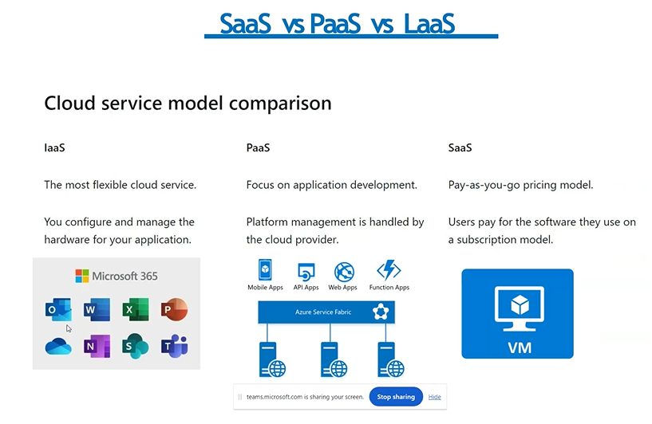

## Types of Cloud Computing :

- 
- 
- Public Cloud : accessible to everyone , managed by 3rd party cloud providers , less control to users ,
- Private Cloud : not accessbile to general public , utilized by particular organization , strict security , control to users only.
- Hybrid Cloud : combination of public and private , expensive , complicate to maintain.
- 
- 
- 
- 
- 
- 
- 
- 

## Azure Regions :

- 

## Azure Region Pairs :

- 

## Availability Zones :

- 
- Inside Availability Zone there are set of data centres
- set of data centres
- one data centres goes down , another data centre available all the time
- We will have a copy of data centres , azure will take care of all
- Availability Zones having independent powers
- Availability Zones should within the 100km to each one
  

## Resources :

- Instances created by us

## Resource Groups :

- 
- resources are combine into resource groups
- 1 Resource having only 1 resource group
- we can switch from 1 resources to one resource group

## Subscriptions :

- User accounts , resources created by users , we will get subscription id we have to pay
- 

## Management Groups :

- Organize Multiple Subscriptions as a single management entity
- Helps us to manage for multiple Subscriptions.Big companies uses it
- 
- Each Management Groups[Parent] have many childs

## Azure Resource Manager[ARM] :

- 
- We have template to create resources by automatically
- ARM template = JSON File[defines what do we want to deploy to Azure]
- Integrate with Azure, PowerShell, CLI , REST API Etc

## Azure Active Directory

- cloud based access management service
- 
- 
- Tenant : means Organization
- 
- 
- 
- 
- 
- 
- 
- 
- 
- 
- 

## Azure Roll Based Access Control [ARBAC]

- 
- 
- 
- 
- 
- 

## Cost Management

- 

## Azure Storage Service

- 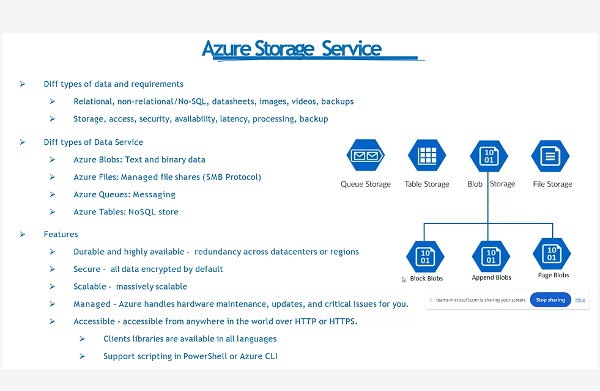

## Azure Data Redundency :

- 
- 

## Blob Storage :

- 
- 

## Storage Access Tiers :

- 
- Hot : we have to to use/access this by daily/Frequently
- Cool :once in a month , week
- Archive :Once in a year , rarely
- 
- 

## Azure Table Storage : Nosql Storage

- 
- 

## Azure File Storage : virtual , stored in storage account

- Cannot be shared acrooss data centres , only for particular data centres
- 
- 

## azure Disk Storage :virtual , stored in storage account

- 

## Data Storage Authorization

- 

## Shared Access Keys Authorization

- 
- 
- 
- 
- 
- 
- 
- 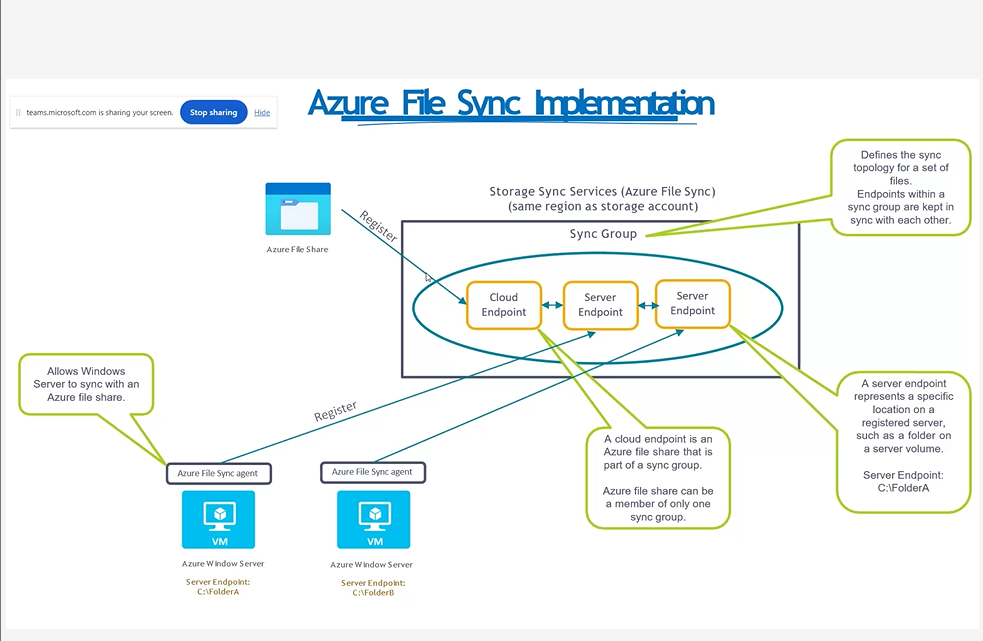
- 
- 
- 
- 
- 
- 
- 
- 
- 
- 
- 
- 
- 
- 
- 
- 
- 
- 
- 
- 
- 
- 

## ARM

- 
- 
- 
- 

## Friday(23/08/2024)

## Azure App Service

- Enables you to build and host webapps, background jobs, mobile back ends and RESTFul API's
- 
- AutoScalling
- High Avaialability : Never down
- Supports Windows and Linux only

## Types of App Service

- 
- Web Apps :
- API Apps
- Web Jobs
- MObile Apps

## Azure App Service BackUp

- 
- 

## Deployment Settings

- 
- 

## App Service- Security

- 

## Containers

- Wrap up an application into its own isolated package
- 

## ACI[container Instance] vs AKI[Kubernet Instance]

- 
- 
- 

## Virtual Machine vs COntainer

- 
- spin up : refresh the system

## Docker & Azure Container Registry

- 

## Docker

- 
- 
- 
- 
- 
- 
- 

## Kubernetes

- 
- 
- 
- 
- 

## Kubernetes architecure

- 
- 
- 

## Azure Kubernetes Services

- 
- 
- 
- 
- Deployment : one or more identical pods
- 
- 
- 

## Azure Networking Services

- 
- 
- 
- 
- 

## Public Vs Private IP Address

- 
- 

## Virtual net[Vnet]

- 
- 
- 
- 
- 
- ## Subnet masking
- 
- 
- 

## NIC Network Interface card : generated automatically whenever a vn is created

- 

## User Defined Route [UDR]

- 
- 

## Network peering

- 
- 

## Virtual Private Network[VPN]

- 
- 
- 

## Service Chaining

- 
- 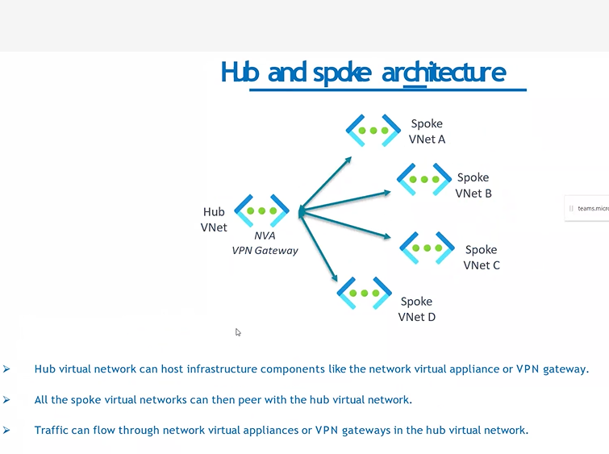
- 

## Domain Name System

- 
- 

## Azure DNS

- 
- 
- 
- 
- 
- 
- 
- 
- 
- 
- 
- 
- 
- 
- 
- 
- 

## Azure Load Balancer

- 
- 
- 
- 
- 
- 

## Load Balancer

- 

## Application GateWay

- 

## URL path based routing

- 

## Multi site Routing

- 
  ##V web application FireWall[WAF]
- 

## Application Gateway Components

- 

## Virutual WAN

## Express Route

- 
- 
- 
- 
- 
- 
- 
- 
- 

## Azure Monitor

- 
- 
- 

## Powershell cli commands

- 

## Wednesday(28/08/2024)

## Azure Training

## Cloud Computing : take features from onpremises[server] to cloud[serverless]

- physically we can see a server
- 
- Pay as you go[Costing]
- server less computing[cloud]
- infinite storage

## Shared Responsibilty Module :

- avaialability zone , resource group , services of azure etc.
- Avaialabilty zone : avaialability high , region can contains multiple avaialability zones/one AZ
- Resource Group :

## SAAS

- 
- 
- Scalability : Use as you go
- Accessibility : How much we access
- Auto Scaling group : automatically increse/decrease based on requirement
- Cost-effectiveness :
- Active Directory :user credentiALS ARE STORED her

## IAAS

- 

## PAAS

- 
- Develpement -->Testing[SIT, UAT,Integration Testing] --->Production[pre, production]
- Hybrid Cloud
- Both features of IAAS and SAAS
  
- 
- Abstraction : data Hiding
- 
- Paramters : for compute
- No of users
- turn around time
- Space /storage
- 

## Azure

- 
- cloud platform

## Azure Services

- 
- 1. Computation :trying to execute on server less machine
- 2. Storage : files , queues , tables and disks
- Container : place to store
- Virtual machine : is on cloud , to host application , server less machine
- 
- 3. Networking
- 4. Security
- 1. Azure Computation
- 
- virtual machine
- container
- Severless computing
- 2. Azure Storage
- 
- 3. Networking
- 

## Thursday(29/08/2024)

- 4. Azure Security : stores passwords , important data
- 
- Identity management : gives access to users , and provides services after verifying user credentials , having 2 methods
- Azure Active Directory for authentication[ checking user credentials] and authorization[giving access]
- Data Encryption
- Threat Protecion
- 5. Azure Monitoring : monitors the billing , costs of users , sends alerts to users through sms, mails regarding how much we have used on azure
- 

## Web Jobs: Background tasks that are run in azure

- 
- Background tasks that are run in azure
- Run by processor manager
- It automates the various tasks like processing , sending mails , monotoring our applications
- Azure monitoring beacause of webjibs

## Benefits of Webjobs

- 

## Types of Webjobs

- 
- 1. continuous wejobs : It runs continuously as long as they are active , ideal for longtime-running tasks like monitoring and data processing.
- 2. Triggered webjobs : Activated for specific tasks/events such as new files in a storage acount or messages in a queue
- 3. Scheduled webjobs : Executed according to a defined schedule , such a daily , weekly , or monthly for tasks requiring regular execution

## Deploying Webjobs

- 

## Monotoring and Debugging Webjobs

- 
- 

## Introduction to Container and Docker

### Container

- 
- lightweight , package it includes everything needed to run on an application

## Benefits of Containerization

- 
- Docker :
- 
- 

## Docker Architecuture

- 
- Docker Clients : commands
- Docker Daemon : Server/host machine
- Docker Image : Instructions to create a contaner
- Registry : stores images
- Design a docker image for any aplication deployment

## Azure Resource manager : Is in json format

## Docker Images

- 
- 
- 
- Cosmos DB : Azure self developed Data base

## Friday(30/08/2024)

## Rivison on Previous Topics :

- Resouce Group : A resource group is a container that holds related resources for an Azure solution. The resource group can include all the resources for the solution, or only those resources that you want to manage as a group.
- stores metadata about the resources.
- Virtual Machine : Service

### Devops : Done Manually

- Developement Operations
- It having branches
- Repository : place where all codes are available
- Source Code Management : tool to maintain codes
- main branch : Production Environment
- Ops : Production
- ITSM : Information technology service management
- 3 parts :Source code management, Staging , Deplyoment -->Deployment Life cycle /PipeLine
- Continuous Integration :
- Continuous Developement:

## ARM :

- Azure Resource Manager (ARM) is a Microsoft Azure service that helps users manage and deploy resources for their Azure account
- ARM uses resource providers to create, update, delete, or retrieve resources in an Azure environment.
- ARM template :
- A JavaScript Object Notation (JSON) file that defines one or more resources to deploy to a resource group, subscription etc...
- 1 Project have 1 ARM , ARM creates Automatically

## Container :

- contains zip , files , codes , all
- Container Engine :Docker
- CICD : automtatically dones the tasks like releases, tags , versions etc..
- Vm - can create os, files
- azure will deploy the container

## Resource vs Services :

- A service is a set of features in Azure
- A resource is the product or object of a service.
- 

## Choosing Azure Regions

- 
- Latency : when any user requesting a service , it will takes time to respond i.e "Latency"[Delay]
- Data Sovereignty : mainatenace of data
- Pricing : Cost
- Avaialability Zones : utilizing zones for resources by deploying our application across physically seperated data centre[Backup] within a region
- 
- Disaster Recover[DR]
- Azure Content Delivary Networ[CDN]
- Resource manAGER - RESOURCES\_\_>ALL

## Microservices :

- 
- Independent Deployment : releasing versions one after another
- Technology Diversity : Different services can use different technologies , allowing teams to choose the best tool for the job.
- Improved scalability : based on demand it allows scaling
- Resilience and Fault Tolerance : Failures in one service are less likely to impact other services , improving application resilience
- 
- Consistency : maintaining same data by not decreasing
- Increased Complexity :
- Distributed Complexity:

## Microservices Architecture

- 
- 

## Git

- Git is an open-source distributed version control in DevOps
- 

## Question 1 : C&D

The development teams that support the Agile approach to DevOps must include staff from the operations teams to ensure:

- A) That stability is prioritised over creativity
- B) Operational considerations are prioritised over stability
- C) Operational considerations are taken into account
- D) The resultant designs of the systems will fit nicely into the business as usual environment

## Question 2 : C

Which statement best describes the relationship between DevOps and Continuous Delivery?

- A) DevOps and Continuous Delivery are the same thing.
- B) DevOps and Continuous Delivery are not related and are mutually exclusive.
- C) DevOps and Continuous Delivery share a background in Agile methods and LEAN thinking.
- D) DevOps and Continuous Delivery share common processes.

## Monday (02/09/2024)

## Microservices Solid Principles :

- 
- Single Responsibility : Each module or a class should have a one and only one reason to change
- Open/Closed :Instead of modifying resources we can change services
- Liskov Substitution: pay as you go like procedure, This means that objects of the child class should be able to substitute objects of the parent class without causing any issues or breaking the application's integrity.
- Ex : 
- Interface Segregation :Azure uses logical isolation to segregate each customer’s data from the data of others. Segregation provides the scale and economic benefits of multi-tenant services while rigorously preventing customers from accessing one another’s data.
- Dependency Inversion/injection : Technique to achieve Inversion of Control (IoC) between classes and their dependencies. Dependency injection in Azure Functions is built on the.NET Core Dependency Injection features.
- Ex : 

## Monolithic Application vs MicroService :

- 

## Tuesday(03/09/2024)

- 
- 
- Branch Policy :who can access to which branch .

## Kubernetes :

- 
- 
- Pods : container
- Cluster : summation of Pods

## Architecture :

- 
- Master Node : It manages all the slave nodes , accessed only by Develeopers
- Slave Node : Contains Pods[is equals to container] , it utuilizes the features of master , accessed by both users and developers.
- Cluster made up of : Master node + Many Slave nodes
- 
- Etcd : used to store the configuration and state of the cluster
- Kubelet[Processor] :runs on each slave node and manage the pods running on that node
- 
- kube-apiserver: The core component server that exposes the Kubernetes HTTP API
- etcd : Consistent and highly-available key value store for all API server data
- kube-scheduler : Looks for Pods not yet bound to a node, and assigns each Pod to a suitable node.
- kube-controller-manager
  Runs controllers to implement Kubernetes API behavior.
- cloud-controller-manager (optional)
  Integrates with underlying cloud provider(s).
- Kubernetes Pods : 

## cloud Shell commands

- 1.To create Aplication Name : az group create --name myapp-rg --location eastus
- 2. To create Resource group :
- az acr create --resource-group myapp-rg --name mycontainerregistry --sku Basic
- az aks create\
- 

## physical devices that connect to and exchange information with a computer network

- Kubernetes Deployment :
- 
- Kubernetes Services :
- 

## Network Policy

- 
- 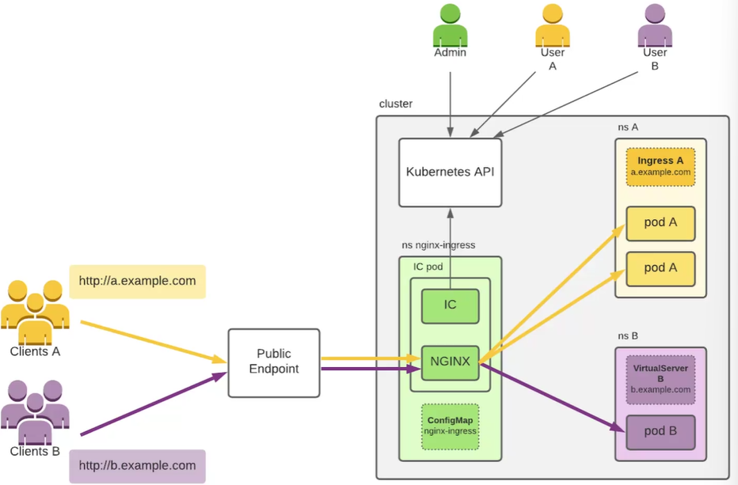

## Design of Any Application

- 
- 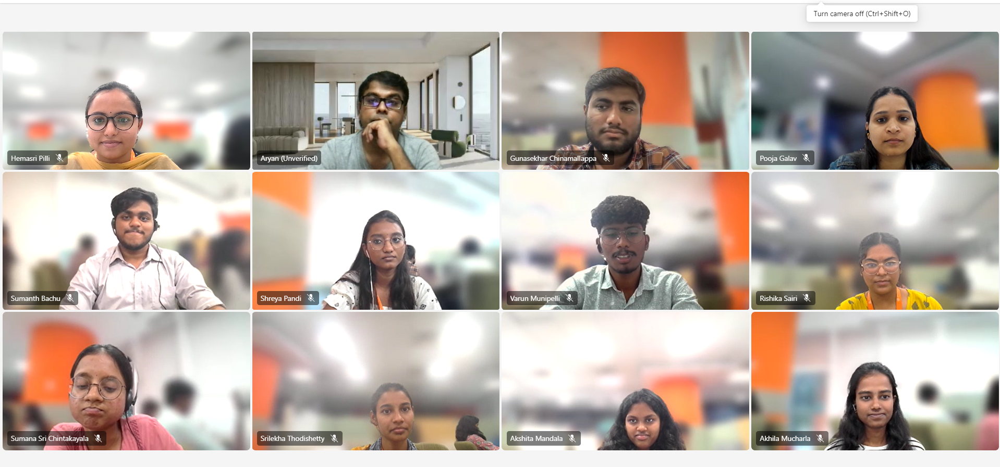

## Wednesday(04/09/2024)

- Kubernetes Architecture
- 
- Kubernetes supports all the feature like not specific to any programming languages , any applications etc..
- Container Runtime(Docker) : containerisation
- Network Proxy :application Run on Different Proxy
- Kubelet : 
- why master node is depend on worker node :
- 
- Master Node Also known as : Control plane Node
- Having 3 features : Authentication , Authorization and Admission Control
- User access workers to get the ms access via the pod but auth,authori and Access IS ALWAYS DONE FROM THE ROOT NODE/CONTROL PANE NODE
- 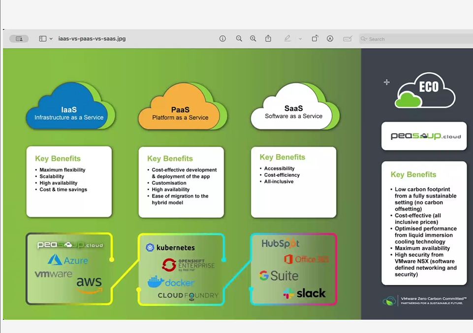
- Kubernetes Cluster : combination of master + worker node
- 
- master node does not need kublet because it dont have runtime like docker
- Replica Set : a controller that ensures a specified number of pod replicas are running at any given time.
- replica set is applicable only for worker node , not master node
- Couple of workers nodes that depend one on another and run together is a Replica Set
- 
- 
- Namesapace :Unique name / Address/Location given to application to deploy in Kubernetes
- 
- 
- 
- Namespace contains : service , pod
- 
- Daemon Set : Service Provider , contains copy of all pods [Exactly One replica on each node] ,
- 
- 
- Controller Manager[mcm] :

## Azure Kubernetes Service :

- Used to deploy and manage containerized applications.
- 
- aims to simplify the deployment and management of Kubernetes clusters

## AKS Architecture :

- 
- 
- Ingresses : Internally progres the services used to process the appplications and services too
- 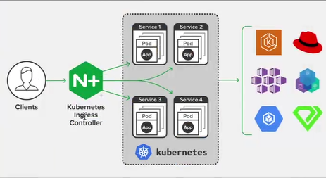
- 
- Ingestion :
- Nodepool:

## Thursday(05/09/2024)

### How Azure Kubernetes Service works in Real time :

- 
- 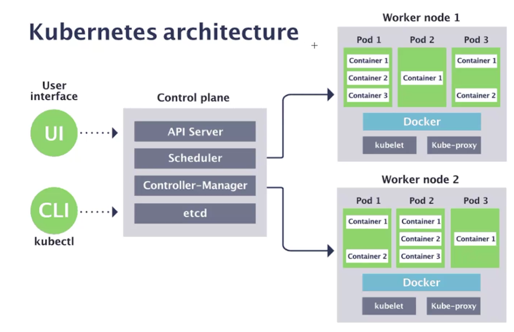

## Kubernetes Ingress Controller :

- 
- Deployments happend in private Ip and service access given to public ip for users requests
- Load balancer take srvice from azure kubernetes service to provide and manage the public IP address
- Load Balancer : Break downs and try to release no of services
- Ingress Controller is a Input and ingress controller service request and public ip to the running on pods, refreshes the pods
- Ingestion : takes care of pods , taken care by AKS ,

## Agile functionalities / azure devops features :

- 
- Epic : High level users stories Task/features ,
- epic is a taking feature to production
- Stories : user stories , non technical explanation
- task : technical functionalities
- Example :
- Epic : To Create s/w like camera
- features : high resolution
- Stories : 1.h/w , s/w , distance check , developers done this
- task : sensor , developers done this
- 

## Kunernetes ConfigMaps And Secrets :

- 
- 

## Namespace :

- 

## Kubernetes Scaling and Autoscaling

- 
- Manual Scaling : We are doing it manually
- Horizontal Pod Autoscalar : Automatically scales base on cpu , memory or custom metrics
- Verticl Pod Autoscalar : Automatically Adjust resource request and limits

## Kubernetes Rolling Updates and Rollbacks :

- 

## Question :

- In designing a high-availability cluster for an e-commerce platform, we deployed a multi-master setup across three availability zones, with etcd members distributed similarly to ensure data redundancy. A TCP load balancer was configured to distribute API requests to the API servers, ensuring no single point of failure. We also implemented node auto-repair with Kubernetes Engine to automatically replace unhealthy nodes.
- Example :
- Taking Netflix scenario as example it consists of multiple master nodes across multiple clusters which are deployed across 3 availability zones .
  The user's request to load the video streaming it uses Load Balancer and the TCP load balancer receives the request and distributes it to one of the available API servers.
  The API server processes the request, retrieves data from backend services like video and sends the response back to the user. During peak hours like live streaming it uses Auto scaling in Kubernetes and Kubernetes performs a rolling update, gradually updating the application pods while keeping the old version running until the new version is fully deployed. and manages the sensitive data .Disaster Recovery: The service remains operational even during large-scale outages, ensuring continued availability for users.

## Kubernetes Monitoring And LOgging :

- 
- kubernetes Fleet manager

## Friday(06/09/2024)

## Docker : Containerized Application

- 
- Mediator b/w application and infrastrcture
- 
- Hypervisor = Ingregation b/w docker and infra
- takes care of docker will be running / Monitor
- A hypervisor is like a manager that helps a single physical computer run multiple virtual computers
- 
- Types : 
- Type 2 is better beacause it folows shared responsibility model and less cost

- Type 1 Hypervisor (Bare-Metal):
- Runs Directly on Hardware: It installs directly on the physical computer and does not need a host operating system.
- Example: VMware ESXi, Microsoft Hyper-V.
- Usage: Often used in data centers and for server virtualization.

- Type 2 Hypervisor (Hosted):
- Runs on Top of a Host OS: It installs on an existing operating system like an application.
- Example: VMware Workstation, Oracle VirtualBox.
- Usage: Commonly used on personal computers for testing and development.
- 

## Difference between Hypervisor And Docker :

- 

## Virtualization :

- 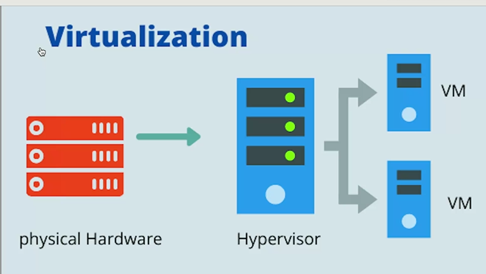

## Docker Container :

- 
- Container : package , library , contains programming language , container runtime to deploy packages
- Containerization : creating self containes pacakage
- Docker :
- 

## Container vs VMs

- 
- Docker is a tool for managing containers and is commonly used in environments where containers are employed.
- VMs provide a method for strong isolation and are crucial for certain applications or environments.
- Containers offer an efficient way to package and run applications and are becoming increasingly popular.
- A Docker container is a running instance of a Docker image. It includes the application code, runtime, libraries, and dependencies required to run the application, and operates in an isolated environment on the host system.

## Docker Image :

- 
- 
- Docker images are read-only templates used to create containers. They contain the application code, runtime, libraries, and other dependencies.
- Images are built using a Dockerfile,

## Docker Daemon :

- a Daemon is a background process that provides services or performs tasks on a computer system without direct user interaction. Daemons are integral to the operation of many system and network services, running autonomously and handling various functions to keep the system and applications running smoothly.

## Docker Networking :

- 

## Docker Volume :

- 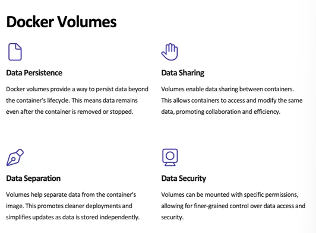
- 
- 

## Docker Compose

- Reduce hardware , creates the images
- tool for defining and running multi-container applications
- 

## Monday(09/09/2024)

- 

## Docker Architecture :

- 
- Docker Host : contains Containers , Images
- A Docker host is a physical or virtual server that runs Docker containers. It houses the Docker Engine, which is responsible for managing and running the containers. The host can be your local machine or a remote server
- Docker Daemon : creates images , and get images from docker Registry ,
- 
- 
- Docker Dameon : 
- It handles various tasks including container creation, execution, and monitoring. In a nutshell, it acts as a bridge between the Docker client and the Docker engine following Client-Server Architecture. Docker daemon executes commands issued by the client by translating them into actionable operations within the Docker environment.
- Docker Registry : Personal location to store Docker images
- It allows you to balance the load, customize the authentication and logging, and make many more configuration changes . It takes data from Clients and
  
- Docker Commands : 
- Internal Process of pull push build and run
- 
- Docker Hub : 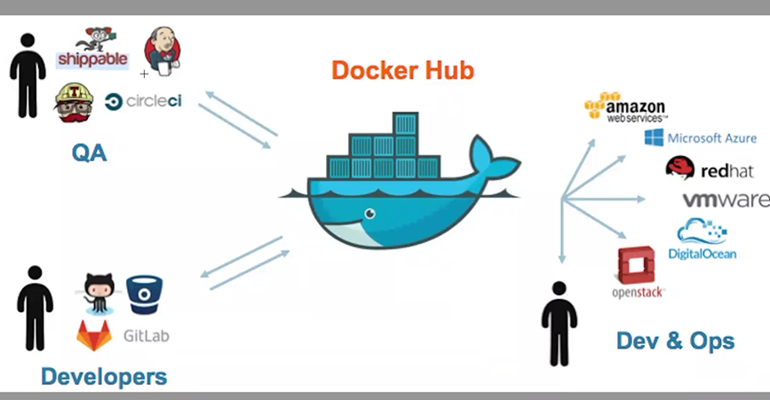
- Docker Hub is a repository service and it is a cloud-based service where people push their Docker Container Images and also pull the Docker Container Images from the Docker Hub anytime or anywhere via the internet. It provides features such as you can push your images as private or public.
- 
- 
- 

## Internal Architecture of Docker :

- 

## Docker 8 Usescases :

- 

## Tenancy : classified based om usecase

- 1 tenant have multiple usecases
- Multiple tenancy : 
- Example : 
- Example : 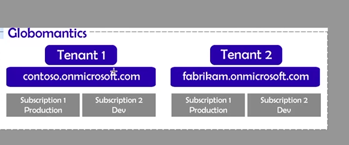

## Exposed Ports : container port publishing

- instancs which are running
- 
- network ports on a Docker container that are made available for communication between the container and the outside world (e.g., other containers, the host machine, or external clients). These are the ports that the containerized application listens to for incoming traffic.

## Created Funtion App , ubuntu of Docker : Practical things

## Capstone :

- 
- 

## Tuesday(10/09/2024)

## Summary of Devops :

- 
- 
- IAM : gives access and utilizing resources
- Subscription : Authorization
- Resource Group:Reorganization , used in clous and Azure
- 
- Service Conncetion integrates with the Azure cloud
- Azure Service Principle Name : gives connection and access controlles , to access and manage resources
- 
- 

## Wednesday(11/09/2024)

## Rivison On Uncovered Topics : and

## ArgoCd : Automatic Deployment

- 

## Architecure of argocd :

- 
- Argo CD automates the deployment of the desired application states in the specified target environments. Application deployments can track updates to branches, tags, or pinned to a specific version of manifests at a Git commit.
-

## Argocd with CLI Kubernetes

- 

##

C:\Users\hemasri.pilli>kubectl create ns argocd
namespace/argocd created

C:\Users\hemasri.pilli>kubectl config current-context docker-desktop
docker-desktop

C:\Users\hemasri.pilli>kubectl config current-context
docker-desktop

C:\Users\hemasri.pilli>kubectl config use-context docker-desktop
Switched to context "docker-desktop".

C:\Users\hemasri.pilli>kubectl create ns hemasriargo
namespace/hemasriargo created

C:\Users\hemasri.pilli>kubectl cordon worker-1
Error from server (NotFound): nodes "worker-1" not found

C:\Users\hemasri.pilli>kubectl get pods
NAME READY STATUS RESTARTS AGE
mywebapi-deployment-75b9c5d85b-ccshs 1/1 Running 2 (3m27s ago) 42d
mywebapi-deployment-75b9c5d85b-dljr8 1/1 Running 2 (3m27s ago) 42d
mywebapi-deployment-75b9c5d85b-nfwvn 1/1 Running 2 (3m27s ago) 42d
mywebapi-deployment-75b9c5d85b-w2f97 1/1 Running 2 (3m27s ago) 42d
mywebapi-deployment-75b9c5d85b-zqfz5 1/1 Running 2 (3m27s ago) 42d

C:\Users\hemasri.pilli>kubectl describe all
Name: mywebapi-deployment-75b9c5d85b-ccshs
Namespace: default
Priority: 0
Service Account: default
Node: docker-desktop/192.168.65.3
Start Time: Wed, 31 Jul 2024 12:45:49 +0530
Labels: app=mywebapi
pod-template-hash=75b9c5d85b
Annotations: <none>
Status: Running
IP: 10.1.0.28
IPs:
IP: 10.1.0.28
Controlled By: ReplicaSet/mywebapi-deployment-75b9c5d85b
Containers:
mywebapi:
Container ID: docker://d3991187b5420eb1aacb3fbf37cd534784fe7fc0b774460f5cddf74234a35f5a
Image: hemasri1234/mywebapi:latest
Image ID: docker-pullable://hemasri1234/employees@sha256:772cf141206832f883c2441db5432c3310f89a8c7e8392dc95ac9da7f7938bd7
Port: 80/TCP
Host Port: 0/TCP
State: Running
Started: Wed, 11 Sep 2024 14:25:43 +0530
Last State: Terminated
Reason: Error
Exit Code: 255
Started: Fri, 23 Aug 2024 11:41:06 +0530
Finished: Wed, 11 Sep 2024 14:25:22 +0530
Ready: True
Restart Count: 2
Environment: <none>
Mounts:
/var/run/secrets/kubernetes.io/serviceaccount from kube-api-access-5df5z (ro)
Conditions:
Type Status
PodReadyToStartContainers True
Initialized True
Ready True
ContainersReady True
PodScheduled True
Volumes:
kube-api-access-5df5z:
Type: Projected (a volume that contains injected data from multiple sources)
TokenExpirationSeconds: 3607
ConfigMapName: kube-root-ca.crt
ConfigMapOptional: <nil>
DownwardAPI: true
QoS Class: BestEffort
Node-Selectors: <none>
Tolerations: node.kubernetes.io/not-ready:NoExecute op=Exists for 300s
node.kubernetes.io/unreachable:NoExecute op=Exists for 300s
Events:
Type Reason Age From Message

---

Normal SandboxChanged 3m52s kubelet Pod sandbox changed, it will be killed and re-created.
Normal Pulling 3m52s kubelet Pulling image "hemasri1234/mywebapi:latest"
Normal Pulled 3m49s kubelet Successfully pulled image "hemasri1234/mywebapi:latest" in 2.496s (2.496s including waiting). Image size: 221283149 bytes.
Normal Created 3m49s kubelet Created container mywebapi
Normal Started 3m49s kubelet Started container mywebapi

Name: mywebapi-deployment-75b9c5d85b-dljr8
Namespace: default
Priority: 0
Service Account: default
Node: docker-desktop/192.168.65.3
Start Time: Wed, 31 Jul 2024 12:20:36 +0530
Labels: app=mywebapi
pod-template-hash=75b9c5d85b
Annotations: <none>
Status: Running
IP: 10.1.0.34
IPs:
IP: 10.1.0.34
Controlled By: ReplicaSet/mywebapi-deployment-75b9c5d85b
Containers:
mywebapi:
Container ID: docker://8f1fc6bcdcc4ec2d836ed716b814493a96780c45b5fe8e36b40365c9e25e14bb
Image: hemasri1234/mywebapi:latest
Image ID: docker-pullable://hemasri1234/employees@sha256:772cf141206832f883c2441db5432c3310f89a8c7e8392dc95ac9da7f7938bd7
Port: 80/TCP
Host Port: 0/TCP
State: Running
Started: Wed, 11 Sep 2024 14:25:54 +0530
Last State: Terminated
Reason: Error
Exit Code: 255
Started: Fri, 23 Aug 2024 11:41:09 +0530
Finished: Wed, 11 Sep 2024 14:25:22 +0530
Ready: True
Restart Count: 2
Environment: <none>
Mounts:
/var/run/secrets/kubernetes.io/serviceaccount from kube-api-access-9zxjx (ro)
Conditions:
Type Status
PodReadyToStartContainers True
Initialized True
Ready True
ContainersReady True
PodScheduled True
Volumes:
kube-api-access-9zxjx:
Type: Projected (a volume that contains injected data from multiple sources)
TokenExpirationSeconds: 3607
ConfigMapName: kube-root-ca.crt
ConfigMapOptional: <nil>
DownwardAPI: true
QoS Class: BestEffort
Node-Selectors: <none>
Tolerations: node.kubernetes.io/not-ready:NoExecute op=Exists for 300s
node.kubernetes.io/unreachable:NoExecute op=Exists for 300s
Events:
Type Reason Age From Message

---

Normal SandboxChanged 3m52s kubelet Pod sandbox changed, it will be killed and re-created.
Normal Pulling 3m51s kubelet Pulling image "hemasri1234/mywebapi:latest"
Normal Pulled 3m39s kubelet Successfully pulled image "hemasri1234/mywebapi:latest" in 3.856s (12.094s including waiting). Image size: 221283149 bytes.
Normal Created 3m38s kubelet Created container mywebapi
Normal Started 3m38s kubelet Started container mywebapi

Name: mywebapi-deployment-75b9c5d85b-nfwvn
Namespace: default
Priority: 0
Service Account: default
Node: docker-desktop/192.168.65.3
Start Time: Wed, 31 Jul 2024 11:55:49 +0530
Labels: app=mywebapi
pod-template-hash=75b9c5d85b
Annotations: <none>
Status: Running
IP: 10.1.0.32
IPs:
IP: 10.1.0.32
Controlled By: ReplicaSet/mywebapi-deployment-75b9c5d85b
Containers:
mywebapi:
Container ID: docker://8c9791041030fc6383e6640ed38150f3522e40178456f6708aff4544192d9cd0
Image: hemasri1234/mywebapi:latest
Image ID: docker-pullable://hemasri1234/employees@sha256:772cf141206832f883c2441db5432c3310f89a8c7e8392dc95ac9da7f7938bd7
Port: 80/TCP
Host Port: 0/TCP
State: Running
Started: Wed, 11 Sep 2024 14:25:50 +0530
Last State: Terminated
Reason: Error
Exit Code: 255
Started: Fri, 23 Aug 2024 11:40:58 +0530
Finished: Wed, 11 Sep 2024 14:25:22 +0530
Ready: True
Restart Count: 2
Environment: <none>
Mounts:
/var/run/secrets/kubernetes.io/serviceaccount from kube-api-access-nt5vr (ro)
Conditions:
Type Status
PodReadyToStartContainers True
Initialized True
Ready True
ContainersReady True
PodScheduled True
Volumes:
kube-api-access-nt5vr:
Type: Projected (a volume that contains injected data from multiple sources)
TokenExpirationSeconds: 3607
ConfigMapName: kube-root-ca.crt
ConfigMapOptional: <nil>
DownwardAPI: true
QoS Class: BestEffort
Node-Selectors: <none>
Tolerations: node.kubernetes.io/not-ready:NoExecute op=Exists for 300s
node.kubernetes.io/unreachable:NoExecute op=Exists for 300s
Events:
Type Reason Age From Message

---

Normal SandboxChanged 3m52s kubelet Pod sandbox changed, it will be killed and re-created.
Normal Pulling 3m51s kubelet Pulling image "hemasri1234/mywebapi:latest"
Normal Pulled 3m43s kubelet Successfully pulled image "hemasri1234/mywebapi:latest" in 3.685s (8.27s including waiting). Image size: 221283149 bytes.
Normal Created 3m42s kubelet Created container mywebapi
Normal Started 3m42s kubelet Started container mywebapi

Name: mywebapi-deployment-75b9c5d85b-w2f97
Namespace: default
Priority: 0
Service Account: default
Node: docker-desktop/192.168.65.3
Start Time: Wed, 31 Jul 2024 11:55:44 +0530
Labels: app=mywebapi
pod-template-hash=75b9c5d85b
Annotations: <none>
Status: Running
IP: 10.1.0.36
IPs:
IP: 10.1.0.36
Controlled By: ReplicaSet/mywebapi-deployment-75b9c5d85b
Containers:
mywebapi:
Container ID: docker://5f8332e09378b4ca1686b1cd18c98e0b8fe4b3e2d70730a738a7ad7fc92a09e2
Image: hemasri1234/mywebapi:latest
Image ID: docker-pullable://hemasri1234/employees@sha256:772cf141206832f883c2441db5432c3310f89a8c7e8392dc95ac9da7f7938bd7
Port: 80/TCP
Host Port: 0/TCP
State: Running
Started: Wed, 11 Sep 2024 14:25:56 +0530
Last State: Terminated
Reason: Error
Exit Code: 255
Started: Fri, 23 Aug 2024 11:41:01 +0530
Finished: Wed, 11 Sep 2024 14:25:22 +0530
Ready: True
Restart Count: 2
Environment: <none>
Mounts:
/var/run/secrets/kubernetes.io/serviceaccount from kube-api-access-bgvjx (ro)
Conditions:
Type Status
PodReadyToStartContainers True
Initialized True
Ready True
ContainersReady True
PodScheduled True
Volumes:
kube-api-access-bgvjx:
Type: Projected (a volume that contains injected data from multiple sources)
TokenExpirationSeconds: 3607
ConfigMapName: kube-root-ca.crt
ConfigMapOptional: <nil>
DownwardAPI: true
QoS Class: BestEffort
Node-Selectors: <none>
Tolerations: node.kubernetes.io/not-ready:NoExecute op=Exists for 300s
node.kubernetes.io/unreachable:NoExecute op=Exists for 300s
Events:
Type Reason Age From Message

---

Normal SandboxChanged 3m52s kubelet Pod sandbox changed, it will be killed and re-created.
Normal Pulling 3m51s kubelet Pulling image "hemasri1234/mywebapi:latest"
Normal Pulled 3m37s kubelet Successfully pulled image "hemasri1234/mywebapi:latest" in 2.348s (14.41s including waiting). Image size: 221283149 bytes.
Normal Created 3m36s kubelet Created container mywebapi
Normal Started 3m36s kubelet Started container mywebapi

Name: mywebapi-deployment-75b9c5d85b-zqfz5
Namespace: default
Priority: 0
Service Account: default
Node: docker-desktop/192.168.65.3
Start Time: Wed, 31 Jul 2024 12:47:45 +0530
Labels: app=mywebapi
pod-template-hash=75b9c5d85b
Annotations: <none>
Status: Running
IP: 10.1.0.30
IPs:
IP: 10.1.0.30
Controlled By: ReplicaSet/mywebapi-deployment-75b9c5d85b
Containers:
mywebapi:
Container ID: docker://f5bdd82a8e7efb5aaa95411259af3903b21378e82d042935de6387c1bcee67da
Image: hemasri1234/mywebapi:latest
Image ID: docker-pullable://hemasri1234/employees@sha256:772cf141206832f883c2441db5432c3310f89a8c7e8392dc95ac9da7f7938bd7
Port: 80/TCP
Host Port: 0/TCP
State: Running
Started: Wed, 11 Sep 2024 14:25:45 +0530
Last State: Terminated
Reason: Error
Exit Code: 255
Started: Fri, 23 Aug 2024 11:40:56 +0530
Finished: Wed, 11 Sep 2024 14:25:22 +0530
Ready: True
Restart Count: 2
Environment: <none>
Mounts:
/var/run/secrets/kubernetes.io/serviceaccount from kube-api-access-4k6cp (ro)
Conditions:
Type Status
PodReadyToStartContainers True
Initialized True
Ready True
ContainersReady True
PodScheduled True
Volumes:
kube-api-access-4k6cp:
Type: Projected (a volume that contains injected data from multiple sources)
TokenExpirationSeconds: 3607
ConfigMapName: kube-root-ca.crt
ConfigMapOptional: <nil>
DownwardAPI: true
QoS Class: BestEffort
Node-Selectors: <none>
Tolerations: node.kubernetes.io/not-ready:NoExecute op=Exists for 300s
node.kubernetes.io/unreachable:NoExecute op=Exists for 300s
Events:
Type Reason Age From Message

---

Normal SandboxChanged 3m52s kubelet Pod sandbox changed, it will be killed and re-created.
Normal Pulling 3m51s kubelet Pulling image "hemasri1234/mywebapi:latest"
Normal Pulled 3m47s kubelet Successfully pulled image "hemasri1234/mywebapi:latest" in 2.392s (4.614s including waiting). Image size: 221283149 bytes.
Normal Created 3m47s kubelet Created container mywebapi
Normal Started 3m47s kubelet Started container mywebapi

Name: kubernetes
Namespace: default
Labels: component=apiserver
provider=kubernetes
Annotations: <none>
Selector: <none>
Type: ClusterIP
IP Family Policy: SingleStack
IP Families: IPv4
IP: 10.96.0.1
IPs: 10.96.0.1
Port: https 443/TCP
TargetPort: 6443/TCP
Endpoints: 192.168.65.3:6443
Session Affinity: None
Events: <none>

Name: mywebapi-service
Namespace: default
Labels: <none>
Annotations: <none>
Selector: app=mywebapi
Type: LoadBalancer
IP Family Policy: SingleStack
IP Families: IPv4
IP: 10.110.57.137
IPs: 10.110.57.137
Port: <unset> 80/TCP
TargetPort: 8080/TCP
NodePort: <unset> 30126/TCP
Endpoints: 10.1.0.28:8080,10.1.0.30:8080,10.1.0.32:8080 + 2 more...
Session Affinity: None
External Traffic Policy: Cluster
Events: <none>

Name: mywebapi-deployment
Namespace: default
CreationTimestamp: Wed, 31 Jul 2024 11:52:50 +0530
Labels: <none>
Annotations: deployment.kubernetes.io/revision: 4
Selector: app=mywebapi
Replicas: 5 desired | 5 updated | 5 total | 5 available | 0 unavailable
StrategyType: RollingUpdate
MinReadySeconds: 0
RollingUpdateStrategy: 25% max unavailable, 25% max surge
Pod Template:
Labels: app=mywebapi
Containers:
mywebapi:
Image: hemasri1234/mywebapi:latest
Port: 80/TCP
Host Port: 0/TCP
Environment: <none>
Mounts: <none>
Volumes: <none>
Node-Selectors: <none>
Tolerations: <none>
Conditions:
Type Status Reason

---

Progressing True NewReplicaSetAvailable
Available True MinimumReplicasAvailable
OldReplicaSets: mywebapi-deployment-5ff547b8cb (0/0 replicas created), mywebapi-deployment-57cbbcfb55 (0/0 replicas created)
NewReplicaSet: mywebapi-deployment-75b9c5d85b (5/5 replicas created)
Events: <none>

Name: mywebapi-deployment-57cbbcfb55
Namespace: default
Selector: app=mywebapi,pod-template-hash=57cbbcfb55
Labels: app=mywebapi
pod-template-hash=57cbbcfb55
Annotations: deployment.kubernetes.io/desired-replicas: 4
deployment.kubernetes.io/max-replicas: 5
deployment.kubernetes.io/revision: 3
Controlled By: Deployment/mywebapi-deployment
Replicas: 0 current / 0 desired
Pods Status: 0 Running / 0 Waiting / 0 Succeeded / 0 Failed
Pod Template:
Labels: app=mywebapi
pod-template-hash=57cbbcfb55
Containers:
mywebapi:
Image: /mywebapi:latest
Port: 80/TCP
Host Port: 0/TCP
Environment: <none>
Mounts: <none>
Volumes: <none>
Node-Selectors: <none>
Tolerations: <none>
Events: <none>

Name: mywebapi-deployment-5ff547b8cb
Namespace: default
Selector: app=mywebapi,pod-template-hash=5ff547b8cb
Labels: app=mywebapi
pod-template-hash=5ff547b8cb
Annotations: deployment.kubernetes.io/desired-replicas: 2
deployment.kubernetes.io/max-replicas: 3
deployment.kubernetes.io/revision: 1
Controlled By: Deployment/mywebapi-deployment
Replicas: 0 current / 0 desired
Pods Status: 0 Running / 0 Waiting / 0 Succeeded / 0 Failed
Pod Template:
Labels: app=mywebapi
pod-template-hash=5ff547b8cb
Containers:
mywebapi:
Image: anandpissey/mywebapi:latest
Port: 80/TCP
Host Port: 0/TCP
Environment: <none>
Mounts: <none>
Volumes: <none>
Node-Selectors: <none>
Tolerations: <none>
Events: <none>

Name: mywebapi-deployment-75b9c5d85b
Namespace: default
Selector: app=mywebapi,pod-template-hash=75b9c5d85b
Labels: app=mywebapi
pod-template-hash=75b9c5d85b
Annotations: deployment.kubernetes.io/desired-replicas: 5
deployment.kubernetes.io/max-replicas: 7
deployment.kubernetes.io/revision: 4
deployment.kubernetes.io/revision-history: 2
Controlled By: Deployment/mywebapi-deployment
Replicas: 5 current / 5 desired
Pods Status: 5 Running / 0 Waiting / 0 Succeeded / 0 Failed
Pod Template:
Labels: app=mywebapi
pod-template-hash=75b9c5d85b
Containers:
mywebapi:
Image: hemasri1234/mywebapi:latest
Port: 80/TCP
Host Port: 0/TCP
Environment: <none>
Mounts: <none>
Volumes: <none>
Node-Selectors: <none>
Tolerations: <none>
Events: <none>

C:\Users\hemasri.pilli>kubectl get pods
NAME READY STATUS RESTARTS AGE
mywebapi-deployment-75b9c5d85b-ccshs 1/1 Running 2 (6m9s ago) 42d
mywebapi-deployment-75b9c5d85b-dljr8 1/1 Running 2 (6m9s ago) 42d
mywebapi-deployment-75b9c5d85b-nfwvn 1/1 Running 2 (6m9s ago) 42d
mywebapi-deployment-75b9c5d85b-w2f97 1/1 Running 2 (6m9s ago) 42d
mywebapi-deployment-75b9c5d85b-zqfz5 1/1 Running 2 (6m9s ago) 42d

C:\Users\hemasri.pilli>kubectl logs mywebapi-deployment mywebapi-deployment-75b9c5d85b-ccshs
error: error from server (NotFound): pods "mywebapi-deployment" not found in namespace "default"

C:\Users\hemasri.pilli>kubectl logs mywebapi-deployment-75b9c5d85b-ccshs
info: Microsoft.Hosting.Lifetime[14]
Now listening on: http://[::]:8080
info: Microsoft.Hosting.Lifetime[0]
Application started. Press Ctrl+C to shut down.
info: Microsoft.Hosting.Lifetime[0]
Hosting environment: Production
info: Microsoft.Hosting.Lifetime[0]
Content root path: /app

## K8s

-
- 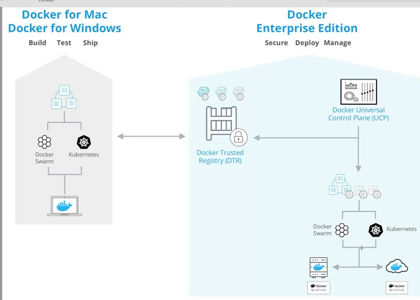

## docker file

- 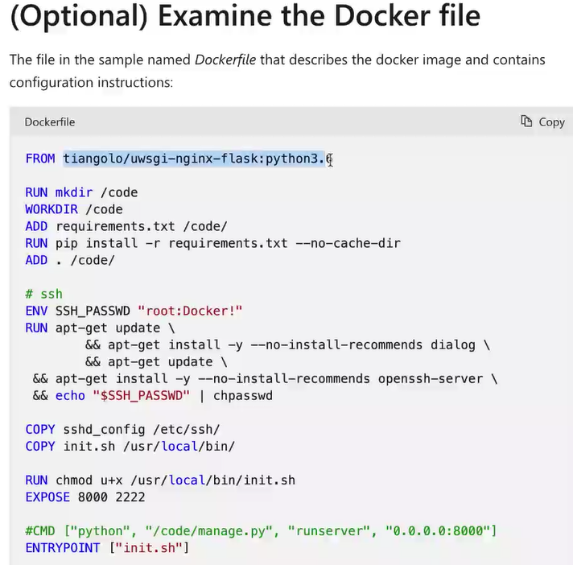

## Blob storage :

- used in databases to store multimedia files and other types of files that are too large to be saved in regular fields. BLOB objects generally represent complex, large, and heavy files.

## Partioning : Auto Scaling , inbuilt in Azure

## Thursday(12/09/2024)

## Logic Apps :

- 
- to create automated workflows and integrate applications, data, and services.
- 2 types : consumption logic app , Standard logic app

## MFA

- https://learn.microsoft.com/en-us/entra/identity/authentication/howto-mfaserver-windows

## Application Gateway

- A gateway is a connecting point of any network that helps it to connect with different networks.
- 

## Service Bus :

- Multiple services can exists inside nodes
- Cloud-based messaging platform that allows different applications, services, and systems to communicate with each other through messages.
- It ensures reliable and asynchronous communication, handling complex messaging patterns and scenarios.

## Security :

- IAM is the Security fEature

## Redis Database :

sudo kubeadm join kubernetes.docker.internal:6443 --token unpqks.tvypizfxqsgz0qts --discovery-token-ca-cert-hash sha256:a46ab35cc9b49511ea73816d8de72e9c3e982bf8b2dda69a56aa9d277ed5d121

- 
- having different url : API
  Heirarchy of creating :

## Access control Lists :

- Operator nexus , adm cannot perform changes unless azure gives the permission
- gives access to services , controls ths services , list

##

- 
- Docker Area : in File System

## kubernetes-Requests & Limits

- 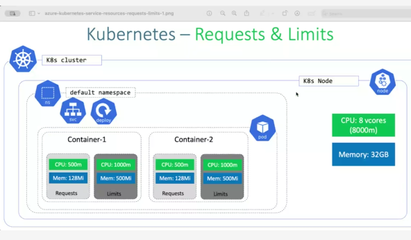

## Argocd

- 
- 
- Tool , having connection from github and and from application
- 

## diff between cosmosDB and RedisCache

- 

## Capstone work --> full day

## Monday(16/092024) : Final Capstone Submission

[text](<../../../Downloads/Capstone Team1.docx.pdf>)

- END TO END DEPLOYMENT OF A .NET APPLICATION

1. Project Overview
   The objective of this capstone project is to design, implement, and deploy a containerized
   .NET-based food delivery application using a Microservices Architecture . The project will
   be deployed across Development (Dev), Quality Assurance (QA), and Production (Prod)
   environments utilizing Azure DevOps, Azure Container Registry (ACR), and Azure
   Kubernetes Service (AKS).
   This project ensures that the application is developed according to best practices such as
   microservices architecture, which allows modularity, scalability, and separation of concerns..
   CI/CD pipelines are leveraged to automate build, testing, and deployment, while Azure
   Kubernetes Service is used for orchestrating containerized microservices.
2. Technology Stack
   Microservices Framework:- ASP.NET Core Web API (Microservices)
   Front-End:- Blazor (for client-side)
   Database:- SQL Database
   Cloud Platform:- Microsoft Azure
   Containerization:- Docker
   Container Registry:- Azure Container Registry (ACR)
   Orchestration:- Azure Kubernetes Service (AKS)
   DevOps:- Azure DevOps Pipelines (CI/CD)
   CI/CD:- Azure DevOps Pipelines
   Monitoring:- Azure Monitor, Application Insights
3. Key Objectives
   ● Deploy and manage a .NET Core food delivery application based on microservices
   across Dev, QA, and Prod environments using Docker, ACR, and AKS.
   ● Implement Continuous Integration/Continuous Deployment (CI/CD) pipelines using
   Azure DevOps.
   ● Leverage Azure Kubernetes Service (AKS) for orchestrating microservices, ensuring
   scalability, security, and fault tolerance.
   ● Integrate Azure Portal features for managing infrastructure (e.g., Azure Key Vault,
   Azure SQL Database, Application Insights).
4. Development Environment Setup for Online Food Delivery Application
   4.1 Install Visual Studio
   ● Download and install Visual Studio (Community, Professional, or Enterprise).
   ● Select workloads: Choose ASP.NET and web development
   4.2 Create a New .NET Project
   ● Open Visual Studio > Create a new project > Select ASP.NET Core Web API.
   ● Configure project name (FoodDeliveryApp) and location.
   4.3 Configure Local Development
   ● Edit launchSettings.json to set up ports and environment variables.
5. Setting Up Azure DevOps for Online Food Delivery Application
   5.1 Create an Azure DevOps Organization and Project
   ● Go to Azure DevOps > Create New Organization or select existing.
   ● New Project > Enter FoodDeliveryApp > Choose Private/Public > Click Create.
   5.2 SetUp Repos and Pipelines
   ● Azure Repos: Create repositories for each microservice and Follow the instructions
   to push your local repository to Azure Repos
   git clone https://github.com/akshita-2002/Online-Food-Deliverygit remote add origin
   git push -u origin master
   git checkout dev
   git add .
   git commit -m “Changes made in payment page”
   git push
   ● Pull Requests : Raise pull requests to push code to Test and Prod branch
   ● Azure Boards: Track tasks and progress with Epics, User Stories, and Tasks.
6. Project Architecture
   ● Microservices Architecture
   The application is broken down into multiple microservices, each responsible for a
   distinct business domain:
7. Order Service: Manages the process of ordering food.
8. Payment Service: Handles payment processing.
9. Menu Service: Manages food menus and item availability.
10. User Authentication Service: Manages customer accounts and authentication.
11. Notification Service: Sends notifications (e.g., order confirmations) to
    customers.
    Each microservice is developed independently using ASP.NET Core Web API
    and can communicate with each other through HTTP. Each service has its own
    database for data persistence following the Database per Microservice pattern,
    which ensures decoupling of services.
    ● API Gateway:
    An API Gateway serves as the entry point for clients to interact with the system. It
    routes requests to the appropriate microservices, handles load balancing,
    authentication, and authorization, and simplifies interactions between the client and
    the backend services.
    ● Database Layer:
    Each microservice will use its own Azure SQL Database instance, promoting
    independent scalability and data ownership.
    ● Containerization:
    Docker: Each microservice is containerized using Docker, allowing them to run
    independently across different environments.
    Azure Container Registry (ACR): Docker images are stored in ACR for version
    control and efficient deployment across environments.
    ● Orchestration:
    Azure Kubernetes Service (AKS): Kubernetes is used for orchestrating microservices
    in each environment (Dev, QA, Prod). AKS provides container scaling, fault
    tolerance, and service discovery.
    Architecture :
12. Project Phases
    Phase 1: Microservices Development and Containerization
    Microservice Design:
    Each microservice is developed independently following the SOLID principles to ensure
    maintainability and scalability.
    Use ASP.NET Core Web API for server connection and Blazor for client side pages
    Dockerization of Microservices:
    For each microservice, create a Dockerfile to build the container.
    Dockerfile for FoodApp:
    Phase 2: Azure Container Registry (ACR) Setup
    Create Azure Container Registry:
    Set up an Azure Container Registry (ACR) to store Docker images for all microservices.
    Phase 3: CI/CD Pipeline Setup for Microservices
    Create CI Pipeline (Build & Push Docker Images to ACR):
    Define a pipeline in Azure DevOps that builds the microservices, creates Docker images, and
    pushes them to ACR.
    Azure DevOps YAML Pipeline:
    Create CD/CI Pipeline (Deploy to AKS):
    Set up a release pipeline in Azure DevOps for deploying the containerized microservices to
    Azure Kubernetes Service (AKS).
    Phase 4: Azure Kubernetes Service (AKS) and Resource Management
    Set Up AKS Cluster:
    Create an AKS cluster for each environment (Dev, QA, Prod).
    Configure node pools, scaling options, and resource limits to ensure efficient resource
    utilization.
    Deploy Microservices to AKS:
    Use Azure DevOps release pipelines to deploy the microservices to AKS clusters in each
    environment.
    Use Helm or native Kubernetes manifests to manage deployments.
    Service Discovery and Load Balancing:
    Set up Kubernetes Services to expose microservices within the cluster and use Ingress for
    external access.
    Phase 5: Testing and Monitoring
    Unit Testing:
    Implement Unit Testing to ensure each microservice adheres to the SOLID principles.
    Monitoring and Logs:
    Use Azure Monitor and Application Insights to track performance and errors in real time.
    Set up Alerts for critical incidents (e.g., CPU spikes or service downtime).
13. Security and Compliance :
    7.1 Manage Permissions
    ● Ensure that only authorized users have access to the pipelines and repositories.
    ● Use Azure DevOps groups to manage permissions efficiently.
    7.2 Implement Security Best Practices
    ● Regularly review and update access permissions.
    ● Ensure that sensitive information (like connection strings) is stored securely using
    Azure Key Vault.
14. Conclusion :
    This guide provides a comprehensive overview of setting up an end-to-end pipeline for a
    .NET-based microservice in Azure DevOps. By following these steps, you can ensure a
    smooth development, QA, and production deployment process. Each section includes
    essential tasks and considerations, and screenshots should be added at each step to provide
    visual guidance.
